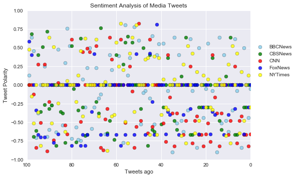
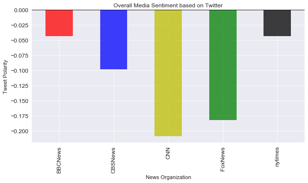

```python
import numpy as np
import pandas as pd
import tweepy
from  datetime import datetime
import json
import matplotlib.pyplot as plt
import seaborn as sns
from vaderSentiment.vaderSentiment import SentimentIntensityAnalyzer
analyzer = SentimentIntensityAnalyzer()
```


```python
# Twitter API Keys: Enter your own API Keys....
consumer_key = ''
consumer_secret = ''
access_token = ''
access_token_secret = ''
```


```python
# Setup Tweepy API Authentication
auth = tweepy.OAuthHandler(consumer_key, consumer_secret)
auth.set_access_token(access_token, access_token_secret)
api = tweepy.API(auth, parser=tweepy.parsers.JSONParser())
```


```python
target_user = ("BBCNews", "CBSNews", "CNN", "FoxNews", "nytimes")
```


```python
# Variables for holding sentiments
sentiments = []

    
compound_list = []
positive_list = []
negative_list = []
neutral_list = []
```


```python

    
```


```python

```


```python
# Loop through each user
for user in target_user:
    
    #counter to be used for tweets ago count
    counter = 1


    # Loop through 5 pages of tweets (total 100 tweets)
    for x in range(5):

        # Get all tweets from home feed
        public_tweets = api.user_timeline(user, page=x)
        
        # Loop through all tweets
        for tweet in public_tweets:

            # Run Vader Analysis on each tweet
            compound = analyzer.polarity_scores(tweet["text"])["compound"]
            pos = analyzer.polarity_scores(tweet["text"])["pos"]
            neu = analyzer.polarity_scores(tweet["text"])["neu"]
            neg = analyzer.polarity_scores(tweet["text"])["neg"]
        
            # Add each value to the appropriate array
            compound_list.append(compound)
            positive_list.append(pos)
            negative_list.append(neg)
            neutral_list.append(neu)
            
            # Build a sentiments dict
            sentiments_dict = {"User": tweet["user"]["screen_name"],
                          "Date": tweet["created_at"], 
                          "Compound": compound,
                          "Positive": pos,
                          "Negative": neg,
                          "Neutral": neu,
                          "Tweets Ago": counter,
                          "Tweet Text": tweet["text"]}
        
            # Add to counter 
            counter = counter + 1
            
            # append sentiments dict to array
            sentiments.append(sentiments_dict)
            
    
```


```python
len(sentiments)
```


    500


```python

```


```python
sentiments_df = pd.DataFrame(sentiments)
sentiments_df = sentiments_df[["User", "Tweets Ago", "Date", "Compound", "Positive", "Negative", "Neutral", "Tweet Text"]]
sentiments_df.head()
```


<div>
<style>
    .dataframe thead tr:only-child th {
        text-align: right;
    }

    .dataframe thead th {
        text-align: left;
    }

    .dataframe tbody tr th {
        vertical-align: top;
    }
</style>
<table border="1" class="dataframe">
  <thead>
    <tr style="text-align: right;">
      <th></th>
      <th>User</th>
      <th>Tweets Ago</th>
      <th>Date</th>
      <th>Compound</th>
      <th>Positive</th>
      <th>Negative</th>
      <th>Neutral</th>
      <th>Tweet Text</th>
    </tr>
  </thead>
  <tbody>
    <tr>
      <th>0</th>
      <td>BBCNews</td>
      <td>1</td>
      <td>Sun Nov 05 23:15:46 +0000 2017</td>
      <td>-0.0516</td>
      <td>0.000</td>
      <td>0.085</td>
      <td>0.915</td>
      <td>Monday's Mail: "Queen Dragged Into £10m Offsho...</td>
    </tr>
    <tr>
      <th>1</th>
      <td>BBCNews</td>
      <td>2</td>
      <td>Sun Nov 05 22:52:01 +0000 2017</td>
      <td>-0.4404</td>
      <td>0.000</td>
      <td>0.209</td>
      <td>0.791</td>
      <td>Monday's Mirror: "Queen's £10m Tax Haven Scand...</td>
    </tr>
    <tr>
      <th>2</th>
      <td>BBCNews</td>
      <td>3</td>
      <td>Sun Nov 05 22:49:02 +0000 2017</td>
      <td>0.0000</td>
      <td>0.000</td>
      <td>0.000</td>
      <td>1.000</td>
      <td>Monday's Times: "Queen invested millions in of...</td>
    </tr>
    <tr>
      <th>3</th>
      <td>BBCNews</td>
      <td>4</td>
      <td>Sun Nov 05 22:44:03 +0000 2017</td>
      <td>0.4939</td>
      <td>0.186</td>
      <td>0.000</td>
      <td>0.814</td>
      <td>Monday's i: "Queen's personal wealth is invest...</td>
    </tr>
    <tr>
      <th>4</th>
      <td>BBCNews</td>
      <td>5</td>
      <td>Sun Nov 05 22:40:04 +0000 2017</td>
      <td>-0.8402</td>
      <td>0.000</td>
      <td>0.455</td>
      <td>0.545</td>
      <td>Monday's Guardian: "Queen's cash invested in c...</td>
    </tr>
  </tbody>
</table>
</div>


```python
sentiments_df.to_csv("twitter_sentiments.csv", index= False, header= True )
```


```python
bbcNews_df = sentiments_df.loc[sentiments_df["User"]=="BBCNews"]
bbcNews_scat = plt.scatter(range(len(bbcNews_df["Tweets Ago"])), bbcNews_df["Compound"], marker="o", facecolor="skyblue", edgecolors="black", label="BBCNews", alpha=0.8,)
```


```python
CBSNews_df = sentiments_df.loc[sentiments_df["User"]=="CBSNews"]
CBSNews_scat = plt.scatter(range(len(CBSNews_df["Tweets Ago"])), CBSNews_df["Compound"], marker="o", facecolor="green", edgecolors="black", label="CBSNews", alpha=0.8,)
```


```python
CNN_df = sentiments_df.loc[sentiments_df["User"]=="CNN"]
CNN_scat = plt.scatter(range(len(CNN_df["Tweets Ago"])), CNN_df["Compound"], marker="o", facecolor="red", edgecolors="black", label="CNN", alpha=0.8,)
```


```python
FoxNews_df = sentiments_df.loc[sentiments_df["User"]=="FoxNews"]
FoxNews_scat = plt.scatter(range(len(FoxNews_df["Tweets Ago"])), FoxNews_df["Compound"], marker="o", facecolor="blue", edgecolors="black", label="FoxNews", alpha=0.8,)
```


```python
nytimes_df = sentiments_df.loc[sentiments_df["User"]=="nytimes"]
nytimes_scat = plt.scatter(range(len(nytimes_df["Tweets Ago"])), nytimes_df["Compound"], marker="o", facecolor="yellow", edgecolors="black", label="NYTimes", alpha=0.8,)
```


```python
plt.ylim(-1, 1)
```


    (-1, 1)


```python
plt.xlim(100, 0)
```


    (100, 0)


```python
# Plot Time Between Tweets

plt.title("Sentiment Analysis of Media Tweets")
plt.ylabel("Tweet Polarity")
plt.xlabel("Tweets ago")
plt.grid(True)

```


```python
#legend
plt.legend(handles = [bbcNews_scat, CBSNews_scat, CNN_scat, FoxNews_scat, nytimes_scat], bbox_to_anchor=(1, 0.8))
```


    <matplotlib.legend.Legend at 0x110984ac8>


```python
plt.savefig('sentiment_analysis_of_media_tweets.png')
plt.show()
```





```python
news_org_group = sentiments_df.groupby(['User'])
news_org_group.head()
```


<div>
<style>
    .dataframe thead tr:only-child th {
        text-align: right;
    }

    .dataframe thead th {
        text-align: left;
    }

    .dataframe tbody tr th {
        vertical-align: top;
    }
</style>
<table border="1" class="dataframe">
  <thead>
    <tr style="text-align: right;">
      <th></th>
      <th>User</th>
      <th>Tweets Ago</th>
      <th>Date</th>
      <th>Compound</th>
      <th>Positive</th>
      <th>Negative</th>
      <th>Neutral</th>
      <th>Tweet Text</th>
    </tr>
  </thead>
  <tbody>
    <tr>
      <th>0</th>
      <td>BBCNews</td>
      <td>1</td>
      <td>Sun Nov 05 23:15:46 +0000 2017</td>
      <td>-0.0516</td>
      <td>0.000</td>
      <td>0.085</td>
      <td>0.915</td>
      <td>Monday's Mail: "Queen Dragged Into £10m Offsho...</td>
    </tr>
    <tr>
      <th>1</th>
      <td>BBCNews</td>
      <td>2</td>
      <td>Sun Nov 05 22:52:01 +0000 2017</td>
      <td>-0.4404</td>
      <td>0.000</td>
      <td>0.209</td>
      <td>0.791</td>
      <td>Monday's Mirror: "Queen's £10m Tax Haven Scand...</td>
    </tr>
    <tr>
      <th>2</th>
      <td>BBCNews</td>
      <td>3</td>
      <td>Sun Nov 05 22:49:02 +0000 2017</td>
      <td>0.0000</td>
      <td>0.000</td>
      <td>0.000</td>
      <td>1.000</td>
      <td>Monday's Times: "Queen invested millions in of...</td>
    </tr>
    <tr>
      <th>3</th>
      <td>BBCNews</td>
      <td>4</td>
      <td>Sun Nov 05 22:44:03 +0000 2017</td>
      <td>0.4939</td>
      <td>0.186</td>
      <td>0.000</td>
      <td>0.814</td>
      <td>Monday's i: "Queen's personal wealth is invest...</td>
    </tr>
    <tr>
      <th>4</th>
      <td>BBCNews</td>
      <td>5</td>
      <td>Sun Nov 05 22:40:04 +0000 2017</td>
      <td>-0.8402</td>
      <td>0.000</td>
      <td>0.455</td>
      <td>0.545</td>
      <td>Monday's Guardian: "Queen's cash invested in c...</td>
    </tr>
    <tr>
      <th>100</th>
      <td>CBSNews</td>
      <td>1</td>
      <td>Sun Nov 05 23:33:32 +0000 2017</td>
      <td>0.0000</td>
      <td>0.000</td>
      <td>0.000</td>
      <td>1.000</td>
      <td>SOON: Law enforcement officials to give update...</td>
    </tr>
    <tr>
      <th>101</th>
      <td>CBSNews</td>
      <td>2</td>
      <td>Sun Nov 05 23:30:33 +0000 2017</td>
      <td>0.0000</td>
      <td>0.000</td>
      <td>0.000</td>
      <td>1.000</td>
      <td>WH Press sec. says Pres. Trump " has been brie...</td>
    </tr>
    <tr>
      <th>102</th>
      <td>CBSNews</td>
      <td>3</td>
      <td>Sun Nov 05 23:12:01 +0000 2017</td>
      <td>-0.2960</td>
      <td>0.000</td>
      <td>0.109</td>
      <td>0.891</td>
      <td>Suspect in deadly Texas shooting served in the...</td>
    </tr>
    <tr>
      <th>103</th>
      <td>CBSNews</td>
      <td>4</td>
      <td>Sun Nov 05 22:48:19 +0000 2017</td>
      <td>-0.2960</td>
      <td>0.000</td>
      <td>0.109</td>
      <td>0.891</td>
      <td>JUST IN: Suspect in Texas church shooting has ...</td>
    </tr>
    <tr>
      <th>104</th>
      <td>CBSNews</td>
      <td>5</td>
      <td>Sun Nov 05 22:39:01 +0000 2017</td>
      <td>0.0000</td>
      <td>0.000</td>
      <td>0.000</td>
      <td>1.000</td>
      <td>"This guy came in around 11:15 a.m. and starte...</td>
    </tr>
    <tr>
      <th>200</th>
      <td>CNN</td>
      <td>1</td>
      <td>Sun Nov 05 23:24:11 +0000 2017</td>
      <td>-0.6597</td>
      <td>0.000</td>
      <td>0.216</td>
      <td>0.784</td>
      <td>A biologic mechanism in yeast cells may explai...</td>
    </tr>
    <tr>
      <th>201</th>
      <td>CNN</td>
      <td>2</td>
      <td>Sun Nov 05 23:09:05 +0000 2017</td>
      <td>-0.8225</td>
      <td>0.000</td>
      <td>0.487</td>
      <td>0.513</td>
      <td>ISIS claims responsibility for suicide attack ...</td>
    </tr>
    <tr>
      <th>202</th>
      <td>CNN</td>
      <td>3</td>
      <td>Sun Nov 05 22:54:06 +0000 2017</td>
      <td>-0.6705</td>
      <td>0.000</td>
      <td>0.360</td>
      <td>0.640</td>
      <td>Suicide bombers target mosque in Kirkuk, Iraq ...</td>
    </tr>
    <tr>
      <th>203</th>
      <td>CNN</td>
      <td>4</td>
      <td>Sun Nov 05 22:50:06 +0000 2017</td>
      <td>-0.6705</td>
      <td>0.000</td>
      <td>0.191</td>
      <td>0.809</td>
      <td>The wife of First Baptist Church Pastor Frank ...</td>
    </tr>
    <tr>
      <th>204</th>
      <td>CNN</td>
      <td>5</td>
      <td>Sun Nov 05 22:42:07 +0000 2017</td>
      <td>-0.4215</td>
      <td>0.000</td>
      <td>0.237</td>
      <td>0.763</td>
      <td>British minister Damian Green denies computer ...</td>
    </tr>
    <tr>
      <th>300</th>
      <td>FoxNews</td>
      <td>1</td>
      <td>Sun Nov 05 23:32:18 +0000 2017</td>
      <td>0.0000</td>
      <td>0.000</td>
      <td>0.000</td>
      <td>1.000</td>
      <td>Right Now: Awaiting news conference on #Suther...</td>
    </tr>
    <tr>
      <th>301</th>
      <td>FoxNews</td>
      <td>2</td>
      <td>Sun Nov 05 23:31:31 +0000 2017</td>
      <td>-0.2960</td>
      <td>0.000</td>
      <td>0.136</td>
      <td>0.864</td>
      <td>.@BretBaier: Authorities: Gunman is Devin Patr...</td>
    </tr>
    <tr>
      <th>302</th>
      <td>FoxNews</td>
      <td>3</td>
      <td>Sun Nov 05 23:28:22 +0000 2017</td>
      <td>0.0000</td>
      <td>0.000</td>
      <td>0.000</td>
      <td>1.000</td>
      <td>Gunman ID'd as Devin Patrick Kelley, 26, male ...</td>
    </tr>
    <tr>
      <th>303</th>
      <td>FoxNews</td>
      <td>4</td>
      <td>Sun Nov 05 23:27:22 +0000 2017</td>
      <td>-0.6597</td>
      <td>0.000</td>
      <td>0.206</td>
      <td>0.794</td>
      <td>.@DanPatrick's message in the wake of the horr...</td>
    </tr>
    <tr>
      <th>304</th>
      <td>FoxNews</td>
      <td>5</td>
      <td>Sun Nov 05 23:26:36 +0000 2017</td>
      <td>0.0000</td>
      <td>0.000</td>
      <td>0.000</td>
      <td>1.000</td>
      <td>.@SenateMajLdr responds to Sutherland Springs ...</td>
    </tr>
    <tr>
      <th>400</th>
      <td>nytimes</td>
      <td>1</td>
      <td>Sun Nov 05 23:32:37 +0000 2017</td>
      <td>-0.2960</td>
      <td>0.000</td>
      <td>0.196</td>
      <td>0.804</td>
      <td>News Analysis: No One Knows What Britain Is An...</td>
    </tr>
    <tr>
      <th>401</th>
      <td>nytimes</td>
      <td>2</td>
      <td>Sun Nov 05 23:20:39 +0000 2017</td>
      <td>0.1280</td>
      <td>0.152</td>
      <td>0.130</td>
      <td>0.717</td>
      <td>Saudi Arabia’s sweeping campaign of arrests in...</td>
    </tr>
    <tr>
      <th>402</th>
      <td>nytimes</td>
      <td>3</td>
      <td>Sun Nov 05 23:00:08 +0000 2017</td>
      <td>0.0000</td>
      <td>0.000</td>
      <td>0.000</td>
      <td>1.000</td>
      <td>Disney scored big with Marvel’s "Thor: Ragnaro...</td>
    </tr>
    <tr>
      <th>403</th>
      <td>nytimes</td>
      <td>4</td>
      <td>Sun Nov 05 22:59:12 +0000 2017</td>
      <td>-0.4767</td>
      <td>0.000</td>
      <td>0.220</td>
      <td>0.780</td>
      <td>A Word With: Laurence Fishburne on the Role Th...</td>
    </tr>
    <tr>
      <th>404</th>
      <td>nytimes</td>
      <td>5</td>
      <td>Sun Nov 05 22:45:05 +0000 2017</td>
      <td>0.1779</td>
      <td>0.130</td>
      <td>0.097</td>
      <td>0.773</td>
      <td>An army of on-the-ground operatives push the g...</td>
    </tr>
  </tbody>
</table>
</div>


```python
compound_mean = news_org_group['Compound'].mean()
compound_mean.head()
```


    User
    BBCNews   -0.043570
    CBSNews   -0.097970
    CNN       -0.208663
    FoxNews   -0.182216
    nytimes   -0.043403
    Name: Compound, dtype: float64


```python
compound_mean_df = pd.DataFrame(compound_mean)
#compound_mean_df = compound_mean_df.reset_index()

```


```python
compound_mean_df.head()
```


<div>
<style>
    .dataframe thead tr:only-child th {
        text-align: right;
    }

    .dataframe thead th {
        text-align: left;
    }

    .dataframe tbody tr th {
        vertical-align: top;
    }
</style>
<table border="1" class="dataframe">
  <thead>
    <tr style="text-align: right;">
      <th></th>
      <th>Compound</th>
    </tr>
    <tr>
      <th>User</th>
      <th></th>
    </tr>
  </thead>
  <tbody>
    <tr>
      <th>BBCNews</th>
      <td>-0.043570</td>
    </tr>
    <tr>
      <th>CBSNews</th>
      <td>-0.097970</td>
    </tr>
    <tr>
      <th>CNN</th>
      <td>-0.208663</td>
    </tr>
    <tr>
      <th>FoxNews</th>
      <td>-0.182216</td>
    </tr>
    <tr>
      <th>nytimes</th>
      <td>-0.043403</td>
    </tr>
  </tbody>
</table>
</div>


```python

```


```python
compound_mean_df["Compound"].plot.bar(figsize=(10,5), alpha=0.75, fontsize=12, color="rbygk")

plt.grid(True, linestyle='dashed')
plt.axhline(0, color='k')
plt.title("Overall Media Sentiment based on Twitter")
plt.ylabel("Tweet Polarity")
plt.xlabel("News Organization")

```


    <matplotlib.text.Text at 0x114ee5be0>


```python
plt.savefig('Overall_Media_sentiment.png')
plt.show()
```





```python

```
